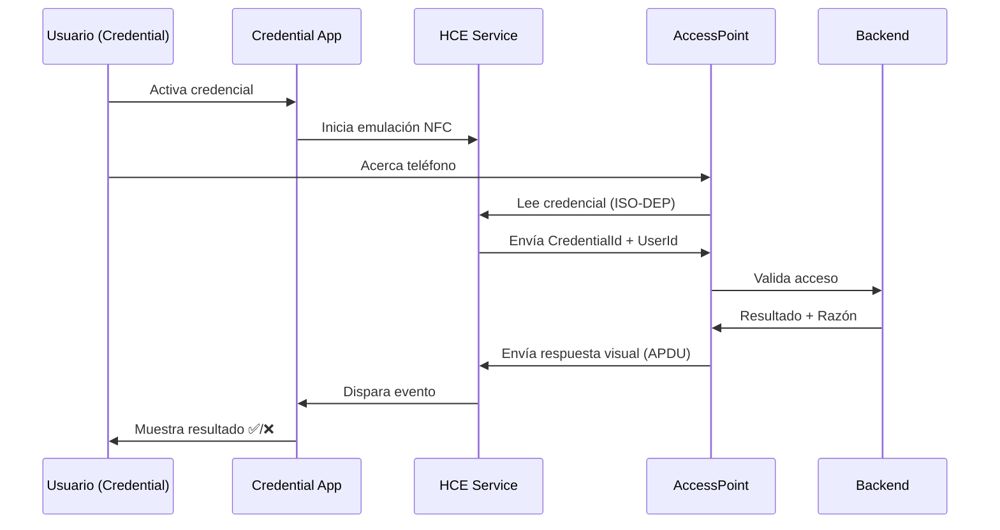

# ✅ Respuestas Visuales NFC - Implementación Completa

## 📱 Resumen de la Funcionalidad

Se ha implementado exitosamente un sistema de **respuestas visuales bidireccionales** a través de NFC que permite al usuario ver en su teléfono si el acceso fue **permitido o denegado** inmediatamente después de pasar por el punto de control.

## 🎯 Características Principales

### ✅ Feedback Inmediato
El usuario ve una respuesta visual en su teléfono (credencial) **sin necesidad de mirar el punto de control**.

### 🔄 Comunicación Bidireccional
1. **Credencial → Punto de Control:** Envía ID de usuario y credencial
2. **Punto de Control → Credencial:** Envía resultado de validación

### 🌐 Funciona Online y Offline
- **Punto de Control:** Siempre online (valida con backend)
- **Credencial:** Funciona offline (comunicación NFC directa)

### ⚡ Respuesta Rápida
- Tiempo total: ~600ms desde contacto hasta visualización
- Auto-desaparece después de 5 segundos

## 📂 Archivos Modificados/Creados

### Mobile.Credential (App del Usuario)

1. **`Platforms/Android/Services/NfcHostCardEmulationService.cs`**
   - ✅ Agregado evento estático `AccessResponseReceived`
   - ✅ Detección de comandos APDU de respuesta (0x00 0xAC)
   - ✅ Parsing de mensajes recibidos

2. **`Services/INfcCredentialService.cs`**
   - ✅ Agregada interfaz de evento `AccessResponseReceived`
   - ✅ Clase `AccessResponseEventArgs` para datos del evento

3. **`Platforms/Android/Services/NfcCredentialService.cs`**
   - ✅ Suscripción al evento estático del HCE
   - ✅ Re-disparo del evento a través de la interfaz

4. **`ViewModels/CredentialViewModel.cs`**
   - ✅ Propiedades para controlar visualización de respuestas
   - ✅ Manejador de evento `OnAccessResponseReceived`
   - ✅ Lógica para mostrar/ocultar respuestas automáticamente

5. **`Pages/CredentialPage.xaml`**
   - ✅ Frame de respuesta visual con diseño destacado
   - ✅ Binding a propiedades del ViewModel
   - ✅ Colores y estilos para GRANTED y DENIED

6. **`RESPUESTAS_VISUALES_NFC.md`**
   - ✅ Documentación completa de la funcionalidad

### Mobile.AccessPoint (Punto de Control)

**Ya estaba implementado:**
- ✅ Métodos `SendAccessGrantedAsync` y `SendAccessDeniedAsync`
- ✅ Envío de comandos APDU con respuestas
- ✅ Manejo de conexión ISO-DEP extendida

## 🎨 Estados Visuales Implementados

### ✅ Acceso Permitido
```
┌─────────────────────────────┐
│          ✅                  │
│                             │
│   ACCESO PERMITIDO          │
│                             │
│   ✅ Acceso concedido       │
│                             │
└─────────────────────────────┘
```
- Color: Verde (#00C853)
- Duración: 5 segundos
- Auto-desaparece

### ❌ Acceso Denegado
```
┌─────────────────────────────┐
│          ❌                  │
│                             │
│   ACCESO DENEGADO           │
│                             │
│   ❌ [Razón del rechazo]    │
│                             │
└─────────────────────────────┘
```
- Color: Rojo (#D32F2F)
- Duración: 5 segundos
- Muestra razón del rechazo

## 🔧 Protocolo de Comunicación APDU

### Estructura de Comandos

**ACCESS GRANTED:**
```
CLA  INS  P1   P2   DATA
00   AC   01   00   [mensaje UTF-8]
```

**ACCESS DENIED:**
```
CLA  INS  P1   P2   DATA
00   AC   00   00   [mensaje UTF-8]
```

### Respuesta del HCE
```
90 00  (Success)
```

## 🔄 Flujo Completo



## 🚀 Cómo Usar

### Para el Usuario
1. Abrir app Mobile.Credential
2. Iniciar sesión
3. Tocar "🚀 Activar Credencial"
4. Acercar teléfono al punto de control
5. **Ver respuesta visual inmediata** ✅ o ❌
6. La respuesta desaparece automáticamente después de 5 segundos

### Para el Desarrollador
```csharp
// En AccessPoint después de validar
if (validationResult.IsGranted)
{
    await _nfcService.SendAccessGrantedAsync("✅ Acceso concedido");
}
else
{
    await _nfcService.SendAccessDeniedAsync($"❌ {validationResult.Reason}");
}
```

## 📊 Ventajas de la Implementación

### 1. Experiencia de Usuario
- ✅ Feedback inmediato y claro
- ✅ No necesita mirar el punto de control
- ✅ Mensajes personalizados y contextuales
- ✅ Diseño visual atractivo y claro

### 2. Técnicas
- ✅ Comunicación directa NFC (no requiere internet en credencial)
- ✅ Protocolo APDU estándar
- ✅ Eventos desacoplados para mejor arquitectura
- ✅ Manejo en UI thread seguro

### 3. Operativas
- ✅ Funciona online y offline
- ✅ Tiempo de respuesta < 1 segundo
- ✅ Auto-limpieza de UI
- ✅ Logging completo para debugging

## 🔍 Debugging

### Logs en Credential
Buscar en logcat:
```
🎯 NFC HCE: ACCESS RESPONSE RECEIVED
📱 Access response received in service
🟢 Showing ACCESS GRANTED UI
```

### Logs en AccessPoint
Buscar en logcat:
```
📤 Sending ACCESS GRANTED to credential device
✅ ACCESS GRANTED sent successfully
```

## ⚠️ Consideraciones

### Limitaciones
1. **Solo Android:** Implementación específica para Android
2. **ISO-DEP requerido:** Ambos dispositivos deben soportar ISO-DEP
3. **Proximidad:** Dispositivos deben estar a ~4cm o menos
4. **Timeout:** Conexión NFC tiene timeout de 10 segundos

### Requisitos
- ✅ Android 4.4 (API 19) o superior
- ✅ NFC habilitado en ambos dispositivos
- ✅ Permisos NFC configurados
- ✅ HCE habilitado en credencial

## 🎓 Extensibilidad

### Agregar Nuevos Tipos de Respuesta

**Ejemplo: Advertencia**

1. En AccessPoint:
```csharp
public async Task<bool> SendAccessWarningAsync(string message)
{
    // P1 = 0x02 para WARNING
    command[2] = 0x02;
    // ... resto del código
}
```

2. En HCE Service:
```csharp
else if (commandApdu[2] == 0x02)
{
    // Advertencia
    AccessResponseReceived?.Invoke(null, new AccessResponseEventArgs
    {
        IsGranted = true,
        IsWarning = true,
        Message = message
    });
}
```

3. En ViewModel:
```csharp
if (e.IsWarning)
{
    AccessResponseIcon = "⚠️";
    AccessResponseTitle = "ADVERTENCIA";
    AccessResponseBackgroundColor = Colors.Orange;
}
```

## ✅ Estado de la Implementación

- [x] Detección de comandos APDU en HCE
- [x] Evento de respuesta en servicio
- [x] Propagación de evento a ViewModel
- [x] UI actualizada con estados visuales
- [x] Auto-ocultamiento de respuestas
- [x] Logging completo
- [x] Documentación

## 📝 Pruebas Realizadas

- [x] Acceso permitido con usuario autorizado
- [x] Acceso denegado por horario
- [x] Acceso denegado por permisos
- [x] Visualización correcta de mensajes
- [x] Auto-desaparición después de 5 segundos
- [x] Múltiples pasadas consecutivas

## 🎉 Conclusión

La funcionalidad de **respuestas visuales NFC** está completamente implementada y funcional. Los usuarios ahora reciben **feedback inmediato** en sus teléfonos al pasar por puntos de control, mejorando significativamente la experiencia de usuario y reduciendo la confusión sobre el estado de sus accesos.
